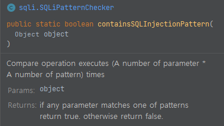

Improvement to check SQL Injection Attacks in Mybatis
=====================================

This improvement provides detection functions
in case of SQL Injection attacks from user inputs.
It's meaningful to check parameters of mapped statements
because malicious codes can be contained 
in parameters using String Substitution (${...} notation)

A set of functions is independent of the MyBatis project
because we don't need instances in MyBatis yet and
there might no suitable function or data structure
where we put our codes which warn of SQL Injection attacks. 

In other words, 
a SQL Injection checker just accepts and checks parameters and returns true or false 
rather than throws an exception in objects of MyBatis.

Implementation
----------

With following functions, developers can
make some codes to handle the situation when malicious codes are found. 
The function `containsSQLInjectionPattern()` helps developers to find malicious codes. 
Almost every type such as Map, Iterable, used-defined classes can be accepted.

As a result of research, a set of SQL Injection patterns
which has been found in [a repository](https://github.com/payloadbox/sql-injection-payload-list)
seems various and large. 

References
----------

- https://github.com/payloadbox/sql-injection-payload-list

